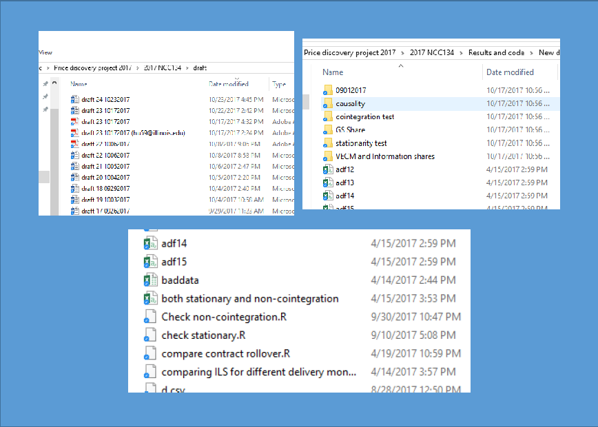
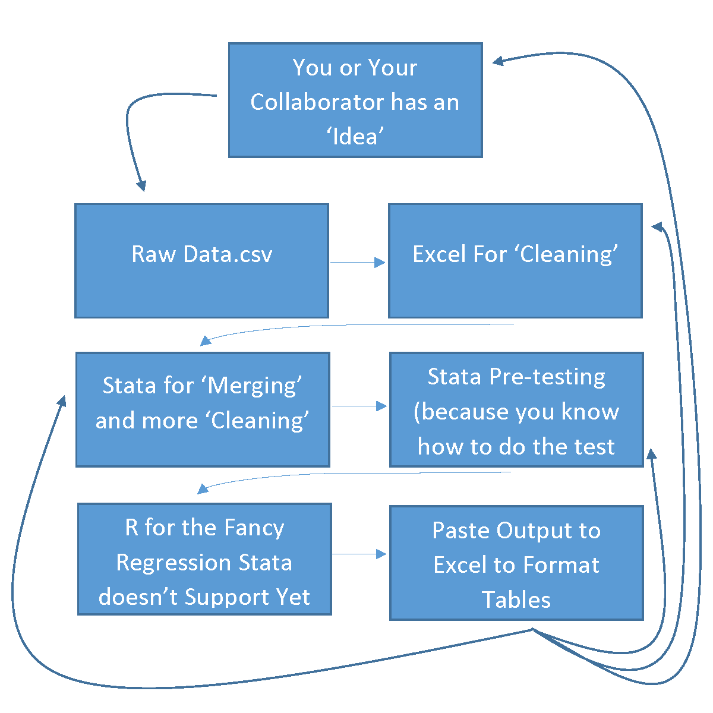

```{r setup, include=FALSE}
knitr::opts_chunk$set(echo = FALSE)
```


## Questions for the Audience

## How many of your research folders look like this?





## How many of you have a research work flow that looks like this?




## Questions for the Audience

\centering

How many of you would rather die than have to reproduce a table from a paper you published 2 years ago? \par


## Questions for the Audience


\centering
Do you wake up in a cold sweat dreaming that Reviewer number 2 asked you to update your data-set (perform robustness test, etc) and you couldn't even reproduce your original results? \par


## Questions for the Audience

\centering
Students, have you ever purposely obfuscated your code figuring if your professor can't follow it they can't criticize it? \par


## Questions for the Audience

\centering
Have you ever lost data between submission and being asked to revise and resubmit and then you had to go and REPURCHASE!!! said data? \par


##  Questions for the Audience 

\centering
Have you ever lost an entire paper due to the Word file becoming corrupted then you thought you salvaged the paper through document recovery but then it got rejected because you missed some weird characters from the file corruption and reviewer number 2 recommended rejecting your paper because the authors were 'careless' to allow the weird characters to remain the document? \par


## I can say yes to all of these questions! 

\centering
But I got tired of being nervous all the time! \par


## Bill Tomek's [-@tomek1993confirmation] AJAE Piece on the Importance of Reproducibility


*Benefits of Confirmation*

+ Reproducibitiy can explain divergent economic results
    "Applied economists usually pre-test with a given dataset to decide on a final model. The process of arriving at hte final model is often neither well understood nore well explained"
    
+ If two competing hypotheses were fully transparant about methods, the research community can vet which is more appropriate and even spot errors.

\tiny{Hat-Tip: Phil Garcia}

## Bill Tomek's [-@tomek1993confirmation] AJAE Piece on the Importance of Reproducibility

*Difficulties in Confirmation*

+ **Data**: Rely on secondary data (say, from USDA), which may be revised and don't keep original files  

+ **Models**: Its often hard to tell *exactly* what a researcher did in terms of model selection, pre-testing, etc, from reading paper alone  

+ **Computer Codes**: Different software may use different methods to implement the same model. Or updates of the same software may change the exact method  

+ **Effect on Colleagues**: We all hate publicly making mistakes!

\tiny{Hat-Tip: Phil Garcia}

## 

\centering
  Now we have tools and solutions to these 'difficulties'!\par


## Reproducible research with R, RStudio, RMarkdown, Knitr, and Github

  + [R](https://www.r-project.org/) - is awesome statistical computing software (open source and free!)  
  
  
  + [Rstudio](https://www.rstudio.com/) - is an awesome integrated development environment (program making it convenient to work with R); also open source and free  


## Reproducible research with R, RStudio, RMarkdown, Knitr, and Github

  + [RMarkdown](http://rmarkdown.rstudio.com/) is a kind of markup language supported by RStudio that uses **Knitr** to weave statistical analysis and results into beautifully formatted documents.  
  
    + Written in plaintext, it understands latex code and documents can be rendered into many different output formats
        + PDF
        + Beamer
        + HTML
        + Word*


## Reproducible research with R, RStudio, RMarkdown, Knitr, and Github


  + [Github](github.com) - is a cloud-based repository that is great at versioning (it was designed by and for software developers)
      
      


## The Basics - Set up a clean, reproducible project repository

+ RStudio Rule #1 - use projects!  
  + Never change the working directory
  + Once you have created a project, the working directory is automatically set to this file path


## The Basics - Put your raw data in the 'data' folder and never touch again 


## The Basics - Organize Scripts

+ Document what each script does  
+ If your project requires an elaborate 'readme.txt' with instructions about which scripts to run and in what order, your work is not reproducible. 


## The Basics - Organize Scripts

+ Document what each script does  
+ If your project requires an elaborate 'readme.txt' with instructions about which scripts to run and in what order, your work is not reproducible. 


## Data Analysis - Cleaning

Your analysis may involve 'cleaning' raw data. 

+ May be aggregating many individual files
+ Dealing with missing data
+ Merging two or many large datasets

This type of activity should be done by the `cleaning.R` script that takes raw data files and makes them useful.

If at all possible, do not save intermediate cleaned data. Run scripts that build from raw data everytime so you know it is reproducible. 

*Look at cleaning.R*


## Data Analysis - Pretesting

Similarly, you may need to check for stationarity or do other common diagnostic tests that inform model choice. 

This file will take cleaned data from `cleaning.R` and perform diagnostics. The tests will create R objects that can be called an inserted into manuscript results.

*Look at pretesting.R*

## Data Analysis - Fit Main Model

Then, your main analysis can be performed in analysis.R. This script will fit model and the output will be R objects that can be inserted to display results directly into tables and text of your manuscript. 

*Look at analysis.R*

## Write Paper in RMarkdown

[RMarkdown](http://rmarkdown.rstudio.com/) is an easy to use way to create reproducible reports that can be rendered to many formats. 

+ Accepts Latex commands for math equations and other formatting
+ Supports reference management with bibtex
+ Excecute R scripts right in the document and incorporate the results into your document

*Look at manuscript.Rmd*

## Stage, Commit, and Push to Github.com

+ Unlike Dropbox and Box that automatically watch for changes and upload new file versions to cloud storage, you have to manually commit changes and send them to the remote repository. 

+ Can be tricky, until you get in the habit of commiting and pushing, similar to how we automatically have the reflext to save a file every so often.

+ Advantage - If your file gets corrupted, it won't overwrite all your copies with the corrupted version (this happened to me with Dropbox).

+ Github is a time machine, you can go back and recover your files at any state of the repository. 

## Stage, Commit, and Push to Github.com

Git Basic Steps:

+ **Stage** - means get changes ready to be commited to the repository
+ **Commit** - means they are 'permanately' part of the repository record
+ **Push** - sends you committed changes to the remote repository for safe keeping forever. 

## Git Clients

Git can be run in a git command line interface (no idea how this works)

Git is integrated in RStudio, and for simple changes it often works ok; however, it can be buggy. 

## Git Clients

[Gitkraken](https://www.gitkraken.com/) is a nice GUI that I find intuitive and easy to use. 


## Gitkraken - Stage


## Gitkraken - Commit


## Gitkraken - Push


## Gitkraken

If you mess up, there is help [on the internet](http://www.ohshitgit.com)


## Commit and Push to Github.com

*Show the Github time machine*

## Use 'Releases' to Mark Important Milestones in Paper's Progress

Since Github was developed by and for software developers, 'Releases' are built in. 

+ Releases signify specific points in the repository's commit history
  + i.e. v2.3.0 of your software
  
+ Convenient for important versions of your paper
  + AAEA invited paper 
  + AJAE submission
  + JARE submission
  + etc...

## Use 'Releases' to Mark Important Milestones in Paper's Progress

This is useful.

+ Say you have a table in your conference paper.  

+ You cut it for the AJAE submission  

+ It gets rejected and you send it to JARE  

+ Reviewer #2 asks you to add exactly this and R&R back to JARE
   - You can go to the AAEA 'release' and recover exactly the state of your repository where you have working code that generates this table
   - Easily incorporate it back into the more recent version
  
  
## How to Prevent Your Code from Breaking

Sometimes, even if you follow these practices, R package updates will break your code!


## How to Prevent Your Code from Breaking

I haven't learned [Docker](https://www.docker.com) yet...

[Info](https://benmarwick.github.io/UW-eScience-docker-for-reproducible-research/)


## How to Prevent Your Code from Breaking

But Docker allows you to keep a copy of R and RStudio exactly as it is today, so you code can never break due to an update. 


## Working with Colaborators who don't RMarkdown

Hypothesis: Applied economists love Microsoft Word more than theoretical economists

Most of my co-authors write papers in Word. 

+ I love writing in Word too! 
  + Track changes and comment bubbles in the margin are genious
  
+ Updating tables and figures in Word is a nightmare
  
## Working with Colaborators who don't RMarkdown 

Compromise for Ease of Use and Reproducibility

+ Write Manuscript in Word

+ Create separate Tables and Figures document generated with R and RMarkdown

You risk making an error in your results discussion in the manuscript because you are manually typing numerical results, but at least the tables and figures are reproducible. 

## Back to Tomek's 1993 AJAE Piece on the Importance of Reproducibility

*Difficulties in Confirmation*

+ **Data**: Rely on secondary data (say from USDA), which may be revised and don't keep original files  

+ **Models**: Its often hard to tell *exactly* what a researcher did in terms of model selection, pre-testing, etc, from reading paper alone  

+ **Computer Codes**: Different software may use different methods to implement the same model. Or updates of the same software may change the exact method  

+ **Effect on Colleagues**: We all hate publicly making mistakes!

**All solved by using modern reproducible methods!**


## Resources to Learn More

I started with this book: [Reproducible Research with R and RStudio](http://christophergandrud.github.io/RepResR-RStudio/)

Lots of resources on the web: 

*Reproducible Research*

+ [Project Tier](http://www.projecttier.org/) 

+ [Blog post by Jodie Burchell](http://t-redactyl.io/blog/2016/10/a-crash-course-in-reproducible-research-in-r.html)
+ [Tutorial by Karl Broman](http://kbroman.org/steps2rr/)
+ [Tomek's 1993 'Confirmation' Paper](https://www.researchgate.net/publication/240248912_Confirmation_and_Replication_in_Empirical_Econometrics_A_Step_Toward_Improved_Scholarship)

*Getting Started with R*

+ [Grolemund and Wickham's R for Data Science](http://r4ds.had.co.nz/)
+ [Colonescu's book on Econometrics with R](https://bookdown.org/ccolonescu/RPoE4/)

\tiny{Hat-Tip: Victor Kononenko for Project Tier info} 

## Thank You!

**Github Repository for this presentation**

+ [github.com/mindymallory/ReproduciblePresentation](https://github.com/mindymallory/ReproduciblePresentation)

**PDF of this presentation**

+ [mindymallory.com/ReproduciblePresentation/pdfs/presentation.pdf](http://mindymallory.com/ReproduciblePresentation/pdfs/presentation.pdf)

**Contact**

+ [mallorym@illinois.edu](mailto:mallorym@illinois.edu)


## Tutorial to Get Set up On Your Own

+ Install [R](https://www.r-project.org/), [RStudio](https://www.rstudio.com/), [Git](https://git-scm.com/downloads), and [Gitkraken](https://www.gitkraken.com/)
+ Install the following packages in R by executing the following commands in the RStudio console:

```{r, echo = TRUE, eval=FALSE}
install.packages("xts")
install.packages("tseries")
install.packages("tsDyn")
install.packages("broom")
install.packages("vars")
```

These packages aren't required for reproducibility, but I use them in the example research project.
      
## Tutorial to Get Set up On Your Own

+ Create a new repository on Github.com
  + Choose a meaningful repository name
  + Be sure to initialize with a Readme file by clicking the checkbox (somehow it helps RStudio and GitHub set an initial connection)
  + After creating the repository
  


##  Tutorial to Get Set up On Your Own

+ After creating the repository, click 'Clone or Download' and copy the link to the repository. 


##  Tutorial to Get Set up On Your Own

+ Open up RStudio and navigate through 'File' -> 'New Project'
+ Choose 'Version Control' -> 'Git'
+ Then paste the link you copied from github.com into 'Repository URL' and click 'Create Project'


## Tutorial to Get Set up On Your Own

Now your RStudio project is connected to Github. Periodically commit your local changes to the Github repository. 

+ Stage Changes
+ Commit Changes
+ Push Changes

## References